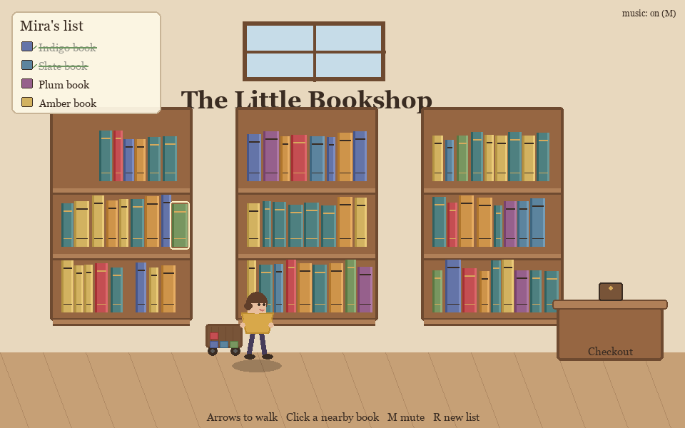
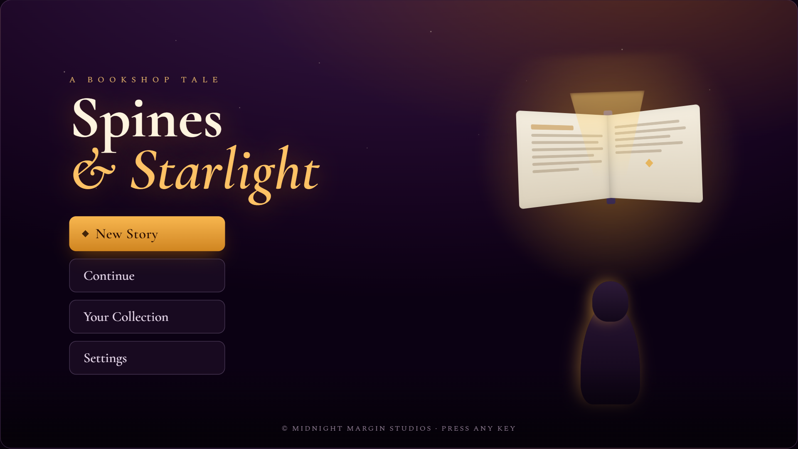
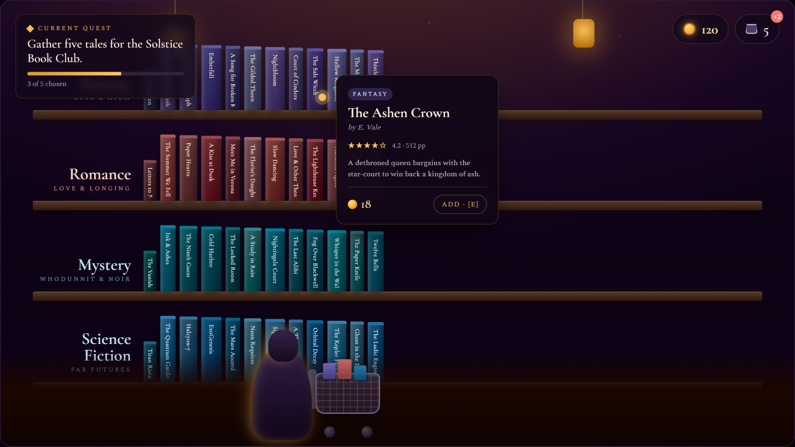
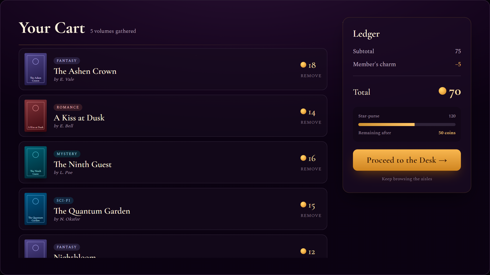
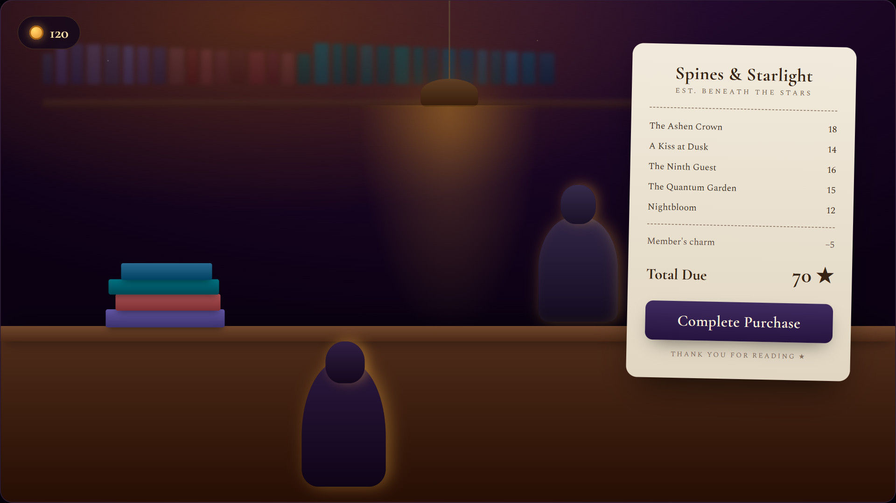
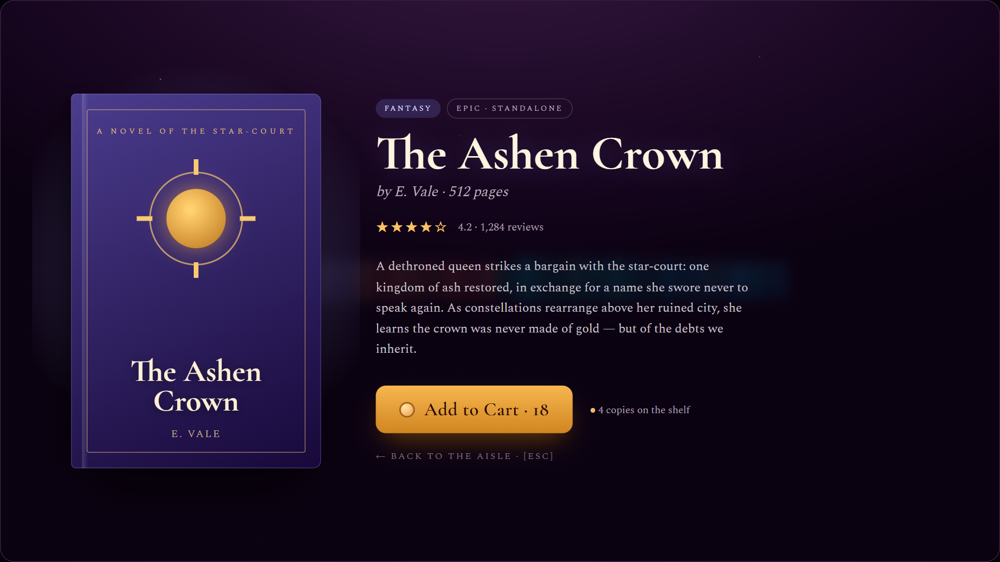

# BookShop: Spines & Starlight

A cozy fantasy bookshop game, lit by falling stars. Browse genre aisles, pull
volumes off the shelf to read them, fill a cart against a "star-purse" coin
budget, and pay the shopkeeper at a lamplit desk.

The project is in two layers:

- **A playable prototype** — [`bookstore.py`](bookstore.py), *"The Little
  Bookshop"*: a single-screen point-and-click where Mira walks a shelf, gathers
  the books on a shopping list, and wheels her cart to checkout.
- **A design concept and spec** — *Spines & Starlight*: a richer, five-screen
  reimagining of that prototype. The concept art lives in
  [`docs/Spines_and_Starlight_UI_Concept.html`](docs/Spines_and_Starlight_UI_Concept.html)
  and the full implementation documentation is in
  [`docs/spines-and-starlight/`](docs/spines-and-starlight/).

---

## Running the prototype

Requires Python 3 and [pygame](https://www.pygame.org/) (the maintained
`pygame-ce` fork is pinned in [`requirements.txt`](requirements.txt)).

```bash
pip install -r requirements.txt   # installs pygame-ce
python bookstore.py
```

A window opens at 960×600.



*The prototype today: Mira gathers books from the shelves while a shopping list
tracks her progress toward the checkout desk.*

### Controls

| Input | Action |
|-------|--------|
| Arrow keys / A, D | Walk Mira left and right |
| Click a nearby book | Add it to the cart |
| Walk to the glowing counter (right) | Check out |
| M | Mute / unmute music |
| R | New list & restock |
| Esc | Quit |

Mira has a shopping list (top-left) of books to find by color. Click the ones
that match, and once the list is complete, wheel the cart to the checkout
counter. The music is generated procedurally at startup — no audio files needed.

---

## The Spines & Starlight concept

*Spines & Starlight* keeps the prototype's core loop — walk, gather, checkout —
and expands it into five screens with real book data, an economy, and a menu.
The look is deep-plum night, gold starlight, and serif type (Cormorant Garamond
and Spectral).

### Preview

These are how each screen is expected to look, captured from the concept art
board — a target for the build, not the running game yet.

**1. Title & Start Menu** — the threshold, as the stars begin to fall.



**2. The Bookshop (Genre Aisles)** — browse Fantasy, Romance, Mystery, and Sci-Fi
shelves; hover a spine for its details.



**3. Your Cart** — review your finds against a starlight budget.



**4. The Checkout Desk** — the shopkeeper stamps each flyleaf by lamplight.



**5. Book Close-Up** — pull a single volume to read its cover, blurb, and price.



### Documentation

The [`docs/spines-and-starlight/`](docs/spines-and-starlight/) folder is a
complete spec for building these screens by extending the pygame prototype:

| Doc | Covers |
|-----|--------|
| [`00-overview.md`](docs/spines-and-starlight/00-overview.md) | Vision, the five-screen map, and how it extends the prototype |
| [`01-design-system.md`](docs/spines-and-starlight/01-design-system.md) | Palette (oklch → pygame RGB), typography, spacing, motion |
| [`02-data-model.md`](docs/spines-and-starlight/02-data-model.md) | Book / cart / economy / quest types and the full book catalog |
| [`03-screen-flow.md`](docs/spines-and-starlight/03-screen-flow.md) | Scene state machine, transitions, and the main-loop rewrite |
| [`04-components.md`](docs/spines-and-starlight/04-components.md) | Reusable widgets (buttons, spines, tooltips, panels, actors) |
| `screen-01`…`screen-05` | Per-screen layout specs with acceptance checklists |

Start with the overview.

---

## Project layout

```
bookshop/
├── bookstore.py                       # playable prototype ("The Little Bookshop")
├── README.md
├── requirements.txt                   # pygame-ce
├── spines/                            # the Spines & Starlight game (python -m spines)
│   ├── theme.py content.py scene.py app.py   # tokens, data, framework, main loop
│   ├── primitives.py widgets.py fonts.py furniture.py actors.py
│   └── scenes/                        # title, shop, detail, cart, checkout
└── docs/
    ├── Spines_and_Starlight_UI_Concept.html   # concept art board (5 screens)
    ├── images/                                # README screenshots
    └── spines-and-starlight/                  # implementation spec (10 docs)
```

## Status

The prototype is playable today, and *Spines & Starlight* is now playable
end-to-end (`python -m spines`) — you can walk Title → Shop → Detail → Cart →
Checkout and back.

### Implementation status

Per-screen acceptance is tracked in each screen's spec doc (the `- [ ]`
checklists). Verification so far is **headless** — smoke tests, logic
assertions, and rendered screenshots — not live playtesting.

| Screen | State | Acceptance |
|--------|-------|-----------|
| 01 · Title | Complete | 7 / 8 — audio (footer/music box) pending |
| 02 · Bookshop | Complete | 7 / 8 — audio pending |
| 03 · Cart | Complete | 9 / 9 |
| 04 · Checkout | Complete | 7 / 7 |
| 05 · Book Close-Up | Complete | 7 / 7 |

Cross-cutting work still pending: **audio** (porting the prototype's procedural
music), **bundled fonts** (Cormorant Garamond / Spectral TTFs — currently serif
SysFont fallbacks), and the Collection / Settings screens (stubbed in the menu).
